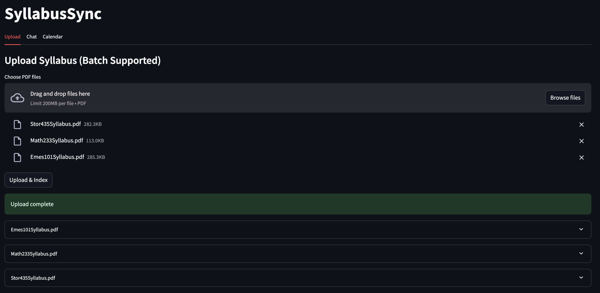

# SyllabusSync

A full-stack RAG app for syllabi: upload PDFs → parse → chunk → embed in pgvector → chat Q&A with citations → export calendar (.ics).

## Stack
- FastAPI (API) + SQLAlchemy + Alembic
- Celery + Redis (jobs)
- Postgres + pgvector (embeddings)
- MinIO (S3-compatible storage)
- Streamlit (UI)
- Docker Compose (local infra)

## Services & Ports
- API: http://localhost:8000 (OpenAPI: http://localhost:8000/docs)
- UI: http://localhost:8501
- MinIO: http://localhost:9000 (console: http://localhost:9001)
- Postgres: localhost:5432, Redis: localhost:6379

## Quick start
1) Copy env and adjust as needed
```bash
cp .env.example .env
# Optional: enable OpenAI for better answers & embeddings
echo 'OPENAI_API_KEY=YOUR_KEY' >> .env
echo 'LLM_PROVIDER=openai' >> .env
echo 'EMBEDDING_PROVIDER=openai' >> .env
```

2) Start stack (builds containers)
```bash
docker compose -f infra/docker/docker-compose.yml up -d --build
```

3) Run DB migrations
```bash
docker compose -f infra/docker/docker-compose.yml run --rm api alembic upgrade head
```

4) Open the UI
```bash
open http://localhost:8501
```

## Using the app
- Upload tab: select one or many PDFs → Upload & Index (jobs will parse → chunk → embed → extract events)
- Chat tab: ask questions without selecting a document; answers include citations (expand to view snippets)
- Calendar tab: pick a version → download .ics

## Screenshots

### Upload


### Chat


## API summary
- POST `/files/presign` → presigned POST (MinIO)
- POST `/files/notify` → create document/version and enqueue jobs
- GET `/qa/ask` → retrieval + answer for a specific version
- POST `/qa/chat` → chat with short history across all user docs
- GET `/documents`, GET `/documents/{id}/versions`
- GET `/calendar/ics?document_version_id=...`

## Upload via curl (optional)
```bash
# 1) Presign
curl -s -X POST http://localhost:8000/files/presign \
  -H 'Content-Type: application/json' \
  -d '{"filename":"syllabus.pdf","content_type":"application/pdf"}' | tee /tmp/presign.json

# 2) Upload to MinIO (replace host for local)
URL=$(jq -r .url /tmp/presign.json | sed 's/minio:9000/localhost:9000/')
CT=$(jq -r '.fields["Content-Type"]' /tmp/presign.json)
KEY=$(jq -r '.fields.key' /tmp/presign.json)
ALG=$(jq -r '.fields["x-amz-algorithm"]' /tmp/presign.json)
CRED=$(jq -r '.fields["x-amz-credential"]' /tmp/presign.json)
DATE=$(jq -r '.fields["x-amz-date"]' /tmp/presign.json)
POLICY=$(jq -r '.fields.policy' /tmp/presign.json)
SIG=$(jq -r '.fields["x-amz-signature"]' /tmp/presign.json)
curl -i -X POST "$URL" \
  -F "key=$KEY" -F "Content-Type=$CT" -F "x-amz-algorithm=$ALG" \
  -F "x-amz-credential=$CRED" -F "x-amz-date=$DATE" \
  -F "policy=$POLICY" -F "x-amz-signature=$SIG" \
  -F "file=@/path/to/your.pdf"

# 3) Notify
STORAGE_URI=$(jq -r .storage_uri /tmp/presign.json)
curl -s -X POST http://localhost:8000/files/notify \
  -H 'Content-Type: application/json' \
  -d '{"title":"Course","storage_uri":"'"$STORAGE_URI"'"}'
```

## Dev workflow (fast reload)
Run infra in Docker; run app processes locally for speed.
```bash
# Infra only
docker compose -f infra/docker/docker-compose.yml up -d postgres redis minio

# API (local)
uvicorn apps.api.main:app --reload

# Worker (local)
celery -A apps.worker.worker:celery_app worker --loglevel=info --concurrency=4

# UI (local)
streamlit run apps/ui/app.py
```

## Repo layout
```
apps/
  api/
    routers/   # health, uploads, qa, chat, documents, calendar
    deps/      # DI providers (db, redis, s3)
    db/        # SQLAlchemy base/session
  worker/
    jobs/      # parse, chunk, embed, events
  ui/          # Streamlit app
packages/
  common/      # config (pydantic-settings), logging
  parsers/     # pdf (PyMuPDF)
  rag/         # chunking, embeddings
alembic/       # migrations (pgvector ext + tables)
infra/docker/  # compose + Dockerfiles
```

## Notes
- Set `OPENAI_API_KEY` and `LLM_PROVIDER=openai` to enable GPT answers; set `EMBEDDING_PROVIDER=openai` for OpenAI embeddings (re-embed existing versions if you change providers).
- Secrets belong only in `.env` (not versioned). If a key was ever committed, rotate and purge from git history before pushing.

## Development
- Lint: `ruff check .`
- Format: `black .`
- Types: `mypy .`
- Test: `pytest`

## Conventional Commits
Use conventional commits (e.g., `feat:`, `fix:`, `chore:`) for consistency.
